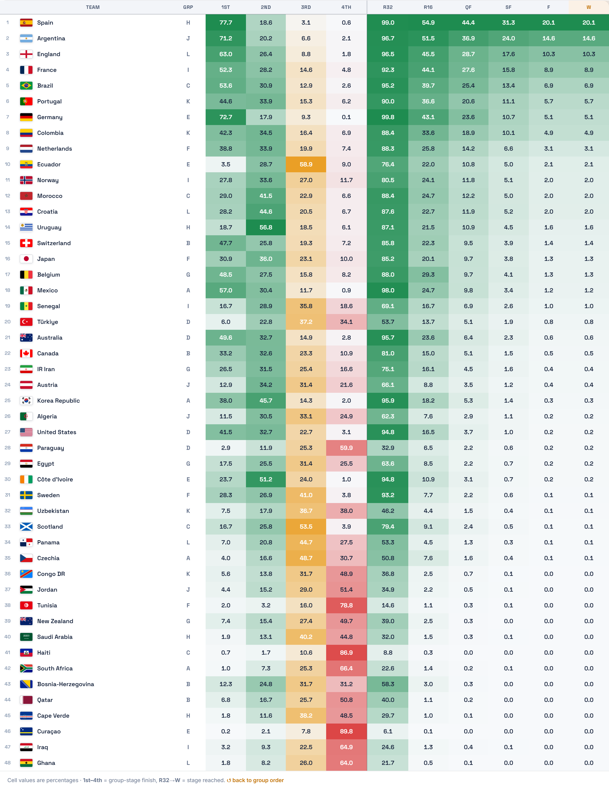

<p align="center">
  <picture>
    <source media="(prefers-color-scheme: dark)" srcset="Data/icons/tournaments_fifa-world-cup-2026--white.football-logos.cc.svg">
    
  </picture>
</p>

<h1 align="center">FIFA World Cup 2026 — Simulation & Prediction Dashboard</h1>

A data-driven forecast of the 2026 FIFA World Cup (48 teams, USA/Canada/Mexico).
The pipeline trains a goals model on ~49,000 historical internationals, runs a
10,000-iteration Monte Carlo of the real 2026 bracket, and renders everything into
a single self-contained file — **`dashboard.html`** — that opens in any browser
with no server.

> **The deliverable is `dashboard.html`.** Everything else in this repo exists to
> build it: scripts that collect the data, train the model, run the simulation, and
> assemble the page.

---

## What the dashboard shows

- **Champion & deep-run odds** for all 48 teams (title %, reach R32 → Final).
- **Group tables** and a full **knockout bracket** prediction.
- **Attack / defense ratings** in real units — expected goals **for/against per game**
  vs an average opponent (run through the fitted model, not an abstract 0–1 score).
- **Player Explorer** — every one of the ~1,250 squad players, searchable/sortable,
  with current-season club output and a Guardian-style bio popup.
- **Awards** — Top Scorer, Player of the Tournament, Young Player, Best Attack/Defense,
  a **predictive Golden Ball race** (see *Golden Ball model* below), and a projected
  **Team of the Tournament** (best XI in a 4-3-3).
- **Match Centre** — every fixture with live scores, plus xG and Player of the Match
  for completed games (during the tournament).
- **Model & Validation** — head-to-head model accuracy & calibration, the ensemble
  blend, a reliability curve, and the Golden Ball backtest (see below).

Current headline result (10,000 sims, **ensemble** model): **Spain 21%**, Argentina 14%,
England 11%, France 9%, Brazil 7%.

### Projection

The dashboard's **Projections** table — every team's probability at each stage across
10,000 simulations, **conditioned on results so far** (12 / 72 group matches played) and
ranked by title odds. Cells are colour-graded by probability.

<p align="center">
  
</p>

---

## How it works (the pipeline)

```
 scrapers ─►  Data/scraped/*       ┐   train_model.py ─┐
 historical ─► Data/data/processed ├─► train_advanced.py ├─► simulate.py ─► build_dashboard.py ─► dashboard.html
 raw inputs ─► Data/data/raw/*     ┘   (GLM+XGB+DC+cal.)─┘     (10k MC)        (renders page)
                                       backtest_goldenball.py ─► WC22 GB validation ─┘
```

### 1. Data collection — `scraper*.py`
| Script | Produces | Source |
|---|---|---|
| `scraper.py` | match/team aggregates | StatsBomb open data (WC22, Euro24, Copa24, AFCON23) |
| `scraper_players.py` | `player_xg.csv` | StatsBomb tournament player xG |
| `scraper_soccerdata.py` | `player_xg_current.csv` | **Understat** 2025-26 club xG (big-5 leagues) via the `soccerdata` package |
| `scraper_squads.py` | `squads_2026.json`, `squad_players.csv` | The Guardian 2026 World Cup squad guide + FIFA rankings |

### 2. The goals model — an ensemble (`train_model.py` + `train_advanced.py`)
The match engine is an **ensemble of three goal models**, each predicting a team's
expected goals λ in a match. Trained on ~49k historical internationals (1950–2026),
recency-weighted with an 8-year half-life.

| Model | What it is |
|---|---|
| **GLM-Poisson** | `StandardScaler → PoissonRegressor(α=0.1)` on 4 Elo/form features — the interpretable baseline (`train_model.py`). |
| **XGBoost** | Gradient-boosted trees, `count:poisson` objective, on a 6-feature set (home/away Elo split + form ratings) — captures non-linear interactions. |
| **Dixon-Coles** | Classic bivariate-Poisson with *separate per-team attack & defence strengths*, a home-advantage term γ, and the low-score ρ correction, fit by time-weighted maximum likelihood (`scipy`). |

The three λ predictions are blended with weights **tuned on the train split** (no
holdout leakage) — the search settled on **0.70·XGBoost + 0.30·Dixon-Coles**.

**Elo-adjusted form ratings** (rolling 7-game window) feed the GLM/XGB:
`off = Σ_last7 [ gf × (opp_elo/1500) ]`, `def = Σ_last7 [ ga × (1500/opp_elo) ]`.
The 2026 offensive rating also blends whole-squad form with individual player
firepower (`0.65·team_form + 0.35·(club xG + 1.5·intl xG)`).

**Calibration & validation (2022+ holdout, 4,392 internationals, never seen in fitting):**

| Model | Accuracy | Log-loss | Brier | ECE |
|---|---|---|---|---|
| GLM-Poisson | 59.7% | 0.880 | 0.518 | 0.017 |
| XGBoost | 60.0% | 0.876 | 0.516 | 0.021 |
| Dixon-Coles | 59.6% | 0.888 | 0.521 | 0.025 |
| **Ensemble** | **60.4%** | **0.864** | **0.509** | 0.018 |

The ensemble wins on every metric, and all models are well-calibrated (ECE < 0.03 —
a 30%-predicted bucket occurs ~30% of the time; see the **Model** tab's reliability
curve). `train_advanced.py` writes `dc_ratings_2026.csv`, `xgb_goals.json`,
`ensemble.json`, and `model_eval.json` (the calibration data the dashboard renders).

### 3. The tournament simulation — `simulate.py`
Monte Carlo over the **official 2026 bracket** (`knockout_slots.csv`, matches 73–104):

- For each match, the **ensemble** gives each team's scoring rate **λ**; goals are
  drawn from Poisson(λ). A small squad-age tilt (peak 27) nudges λ.
- **Group stage:** 12 groups of 4 → top 2 + 8 best third-placed teams advance
  (`fw26_best_third_placed_combinations.csv` handles the 495 best-third cases).
- **Knockouts:** R32 → Final, with extra time (50%) and Elo-weighted penalties.
- **N = 10,000 iterations.** Outputs per-team stage probabilities, a most-likely
  bracket, and the full deterministic bracket to `Data/simulated/`.

### 4. The dashboard — `build_dashboard.py`
Reads the simulated outputs + scraped player/squad data and writes one ~2.7 MB
self-contained `dashboard.html` (HTML + CSS + JS + Plotly, no build step, no server).

---

## Golden Ball model (predicted best player)

The Golden Ball card is a **forecast**, not a goals+assists tally. For every squad
player it blends three signals and weights them by how deep the team is projected to go:

```
gb_index   = form_rating × expected_matches × spotlight
form_rating = club_form · usage  +  0.6 · intl_form
```

- **club_form** — 2025-26 goal involvements per 90: `0.5·(xG90 + xA90) + 0.5·(G+A)/90`.
- **usage** — `minutes / (minutes + 900)`, a saturating "nailed-on starter" weight so a
  fluky per-90 over few minutes can't out-rank an undroppable star.
- **intl_form** — goal output per match in recent national-team tournaments (0 if none).
- **expected_matches** — `3 group games + Σ stage-reach probabilities` (more games = more
  chances + more voter exposure).
- **spotlight** — `1 + (P(semi-final) + P(final))`, because the award almost always
  follows a deep run.

The index is converted to a sharpened win-probability share. *Limitation:* it's an
attacking-output model, so it can't rate deep-lying midfielders or keepers
(a Modrić '18 / Kahn '02 type winner).

**Backtest — 2022 World Cup** (`backtest_goldenball.py`): replaying the scoring logic
on WC22 StatsBomb data (output × actual deep run) ranks **Messi #1** (the real Golden
Ball winner) and **Mbappé #2** (runner-up / Golden Boot) — and ranks Modrić only #78,
which is exactly the documented limitation above. A *pre-tournament* backtest of 2014/2018
would need that era's club-season xG, which isn't in this repo; this validates the core
hypothesis the model encodes. Result is shown in the dashboard's **Model** tab.

---

## Running it

```bash
pip install -r requirements.txt

# Rebuild only the dashboard from existing simulated data:
python scripts/build_dashboard.py        # -> dashboard.html

# Or re-run the full model + simulation pipeline:
python scripts/train_model.py            # fit the GLM-Poisson baseline + 2026 ratings
python scripts/train_advanced.py         # XGBoost + Dixon-Coles + ensemble + calibration
python scripts/simulate.py               # 10,000-iteration ensemble Monte Carlo
python scripts/backtest_goldenball.py    # (optional) WC22 Golden Ball validation
python scripts/build_dashboard.py        # assemble the dashboard
```

Then open `dashboard.html` in any browser.

---

## Live updates (during the tournament)

Once matches start, the forecast can be **conditioned on real results**: finished
scores are locked into the simulation and every projection (champion %, group
standings, knockout odds, awards, Team of the Tournament) updates around them.

```bash
cp .env.example .env                  # then add your free football-data.org key
python scripts/update.py              # fetch -> scrape stats -> re-simulate -> rebuild
```

| Script | Role |
|---|---|
| `fetch_results.py` | Pulls finished scores from the [football-data.org](https://www.football-data.org) API into the schedule + `live_scores.json`. |
| `scraper_fotmob.py` | Per-match **xG**, **Player of the Match** and player ratings (headless browser). |
| `simulate.py` | Re-runs the Monte Carlo with completed matches held fixed. |
| `update.py` | One command for the whole loop; skips the re-sim when nothing changed. |

The dashboard's **Match Centre** tab shows every fixture with live scores, xG and
Player of the Match. The API key is read from `.env` (gitignored) — never committed.

### Deploy (Netlify)

The site is a single static file — no build step. `netlify.toml` publishes the repo
root and rewrites `/` → `/dashboard.html`, so the dashboard loads at the site root.

- **Git deploy:** connect the repo in Netlify → it picks up `netlify.toml` automatically
  (build command: none, publish directory: `.`).
- **CLI deploy:** `npm i -g netlify-cli && netlify deploy --prod`.

To refresh the live site after a data/model update, re-run `python build_dashboard.py`,
commit the regenerated `dashboard.html`, and push — Netlify redeploys on push.

> The scrapers (`scraper*.py`) require network access and are only needed to refresh
> the underlying data; the committed `Data/` snapshot already contains everything the
> train → simulate → build chain needs.

---

## Data sources

- **Elo / historical results** — international match history (1872–2026), processed into
  `training_df.csv` and `final_elo.csv` (ratings for 333 teams).
- **StatsBomb open data** — team & player xG from WC22, Euro 2024, Copa América 2024, AFCON 2023.
- **Understat (via `soccerdata`)** — 2025-26 club-season xG/xA for big-5-league players.
- **The Guardian 2026 squad guide** — real 2026 squads, bios, coaches, star players.
- **FIFA rankings** — June 2026 and October 2022 snapshots (for ranking + trajectory).
- **Official 2026 fixtures** — group draw and the 104-match bracket slots.

---

## Repository layout

```
build_dashboard.py     Renders dashboard.html from simulated + scraped data
simulate.py            10,000-iteration ensemble Monte Carlo of the 2026 bracket
train_model.py         Fits the GLM-Poisson baseline + 2026 team ratings
train_advanced.py      XGBoost + Dixon-Coles + ensemble + calibration analysis
backtest_goldenball.py Golden Ball validation on the 2022 World Cup
scraper*.py            Data collection (StatsBomb / Understat / Guardian)
dashboard.html         ← the deliverable (open in a browser)
Data/
  data/raw/            Group draw, bracket slots, best-third combinations
  data/processed/      Models (GLM/XGB/DC), ratings, ensemble, calibration, Elo
  scraped/             Player xG (club + tournament), 2026 squads
  simulated/           Champion probabilities + bracket predictions
  fifa_ranking_*.csv   FIFA ranking snapshots
```

*Built as a portfolio project. Predictions are probabilistic and for entertainment.*
